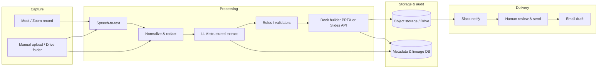

# Part 1 — Solution architecture

## Executive overview

End-to-end flow: **capture** meeting media → **transcribe** to text → **normalize & chunk** for inference → **LLM extraction** (summary, objectives, actions, next steps) with **validators** → **render** Google Slides–compatible deck (via `.pptx` or Slides API) → **store artifacts** → **notify** stakeholders → **human approval** before broad distribution.

This POC implements the middle segment (transcript → structured JSON → `.pptx`) with **SSE** for orchestration visibility.

## Core components

| Stage | Role |
|--------|------|
| **Ingestion** | Upload UI, Drive “drop folder”, or webhook when Meet/Zoom recording lands in object storage. |
| **Transcription (ASR)** | Whisper-class model (OpenAI Whisper API or equivalent) for audio/video; text files skip ASR. |
| **Preprocessing** | Strip email/UI noise, redact PII if required, split long meetings into chunks with overlap. |
| **AI inference** | LLM with JSON schema / tool output: executive summary, 3 objectives, 3 actionable items, next steps, confidence notes. |
| **Business rules** | Cross-check claims against structured signals (e.g. stockout mentions + sales dip) before “impact” language. |
| **Formatting** | Template-driven Slides/PPTX generation; optional Google Slides API for native files. |
| **Storage** | Versioned transcript, model output, final deck, hash of prompts/model versions (audit). |
| **Delivery** | Email draft, Drive link, Slack notification to leadership channel. |
| **Governance** | Human-in-the-loop approval, retention policy, access-controlled buckets. |

## Workflow / data-flow diagram (Mermaid)

## Triggers & schedulers

- **Event-driven**: new file in `s3://tenant-meetings/inbox/` or Drive watch → enqueue job (SQS / Pub/Sub / Cloud Tasks).
- **Scheduled**: nightly reconciliation job for failed uploads; weekly cost report.
- **On-demand**: operator starts run from internal UI (this POC).

## Technology choices (and why)

| Layer | Choice | Rationale |
|--------|--------|-----------|
| UI | React + Vite | Fast dev, easy Hosting deploy, good SSE/EventSource support. |
| API + SSE | FastAPI (Python) | Simple multipart uploads, async, straightforward SSE streaming. |
| ASR | OpenAI Whisper API | Good quality, pay-per-minute, minimal ops for a POC. |
| LLM | `gpt-4o-mini` (or similar) | Cost-aware, strong JSON adherence with `response_format`. |
| Deck | `python-pptx` | No OAuth setup for POC; slides import cleanly into Google Slides. |
| Hosting | Firebase Hosting + **Cloud Run** for API | Hosting for static SPA; Run for long-lived SSE and file handling. |
| Secrets | Secret Manager / CI vars | Keys never in browser; rotate independently. |

**Alternatives**: AWS Transcribe + Bedrock + Lambda (more AWS-native); GCP Speech + Vertex (tighter GCP integration); fully managed Zapier/Make (faster to wire, weaker audit/versioning).

## Privacy & audit (production intent)

- **Data minimization**: process only designated folders; optional PII redaction pass before LLM.
- **Encryption**: TLS in transit; KMS-managed keys at rest on bucket + DB.
- **Lineage**: store prompt hash, model id, transcript hash, and output version for each deck.
- **Access**: workspace SSO, per-tenant IAM, signed URLs with short TTL for downloads.

## POC limitations (honest scope)

- In-memory job registry (no multi-instance safety).
- No Google Slides API or OAuth in-repo.
- Fallback summary is **hand-authored for the single synthetic transcript** when LLM is off.
